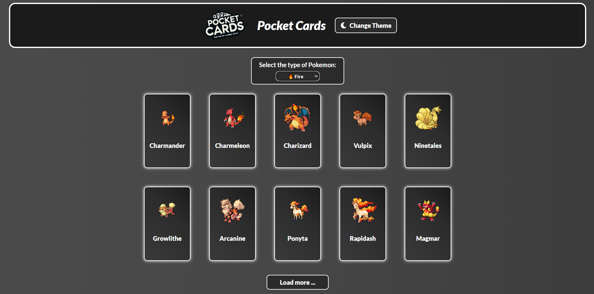
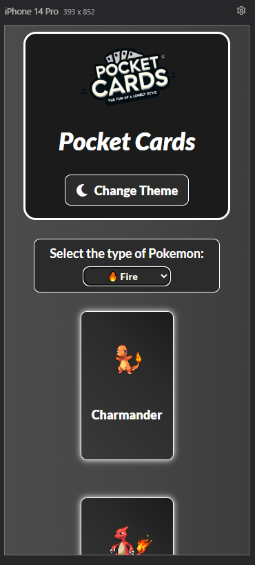

# Quest React Avançado - Teste Técnico Pokedex
 
Este é o teste técnico final do curso DevQuest, do Dev em Dobro, na parte de front-end. O objetivo é simular um teste técnico que pode ser solicitado em um processo seletivo para desenvolvedor front-end.

## Índice

- [Visão geral](#visão-geral)
- [O desafio](#o-desafio)
- [Captura de tela](#captura-de-tela)
- [Links](#links)
- [Meu processo](#meu-processo)
- [Criado com](#criado-com)
- [O que aprendi](#o-que-aprendi)
- [Desenvolvimento contínuo](#desenvolvimento-continuo)
- [Como executar o projeto](#como-executar-o-projeto)
- [Autor](#autor)
- [Agradecimentos](#agradecimentos)

## Visão geral

### O desafio

Criar uma Home (página inicial) para listar alguns Pokémon utilizando a API PokeAPI.

A Home deve conter:

- Uma listagem inicial com 10 Pokémon.
- Um botão "Carregar mais" abaixo dessa lista, que, ao ser clicado, deve buscar mais 10 Pokémon e adicioná-los à listagem atual.
- Exibição da imagem e do nome de cada Pokémon.
- Pokémon clicáveis: ao clicar em um Pokémon, o usuário deve ser direcionado para uma página de detalhes contendo:
    - Imagem do Pokémon.
    - Nome.
    - Lista de movimentos (moves).
    - Lista de habilidades (abilities), incluindo o nome e a descrição de cada habilidade.
    - Tipo do Pokémon (type).
- Um botão para alternar entre tema claro e escuro (light/dark).
- Um campo de filtro (input ou select) para que o usuário possa filtrar os Pokémon por tipo.

### Captura de tela

 

### Links

- URL do repositório: [PokeDex em React](https://github.com/MarioCarlaibe/pokeapi-react-context-api)
- URL do site ativo: [pokeapi-react-context-api.vercel.app](https://pokeapi-react-context-api.vercel.app/)

## Meu processo

### Criado com

- React
- Vite
- Context API
- Axios
- Styled Compponents
- React Router Dom
- React Icons
- Chat GPT4

### O que aprendi

Durante o desenvolvimento deste projeto, aprendi diversos conceitos importantes, incluindo:

- Uso da Context API para alternar o tema da página em conjunto com Styled Components.
- Utilização de variáveis de cores com Styled Components.
- Criação de lógica para requisições com Axios, manipulando os dados da PokéAPI conforme o crescimento do site.
- Implementação e estilização de ícones utilizando React Icons e Styled Components.
- Criação de um filtro para buscar Pokémon por tipo na PokéAPI.

### Desenvolvimento contínuo

Objetivo de cada ferramenta utilizada:

- React e Vite: O Vite facilita a inicialização do projeto em React, enquanto o React possibilita a criação de uma SPA (Single Page Application).
- Context API: Usada para gerenciar a troca de tema no site.
- Axios: Responsável pelas requisições à PokéAPI e manipulação das informações.
- Styled Components: Ferramenta essencial para a estilização do projeto. Foi neste projeto que aprendi a utilizar variáveis dentro do Styled Components.
- React Router Dom: Permite a criação de rotas e navegação eficiente entre os detalhes dos Pokémon.
- React Icons: Usado para estilizar o botão de alternância de tema com ícones de lua e sol. Foi neste projeto que aprendi a utilizar esse recurso.
- ChatGPT-4: Ferramenta de IA que ajudou na compreensão de conceitos, interpretação de documentações e correção de erros lógicos. Foi extremamente útil ao longo do processo.

### Como executar o projeto

Crie uma pasta e abra o terminal (Git Bash, por exemplo).
Certifique-se de ter o Node.js instalado.
Execute os seguintes comandos:
    - git clone https://github.com/MarioCarlaibe/pokeapi-react-context-api
    - cd pokeapi-react-context-api
    - npm install
    - code .
No VS Code, abra um novo terminal (Ctrl + Shift + ' ou acesse pelas opções do editor).
Com o terminal aberto, execute:
    - npm run dev
Acesse o endereço local exibido no terminal (http://localhost:????/) segurando a tecla Ctrl e clicando no link.
Pronto! A página do projeto será aberta no seu navegador.

## Autor

- GitHub - [Mário Carlaibe](https://github.com/MarioCarlaibe)
- Front-end Mentor - [Mário Carlaibe](https://www.frontendmentor.io/profile/MarioCarlaibe)
- LinkedIn - [Mário Carlaibe](https://www.linkedin.com/in/mario-carlaibe/)

## Agradecimentos

Agradeço ao DevQuest pelo conhecimento adquirido, pelas instruções fornecidas, pelo excelente curso e pelos mentores.